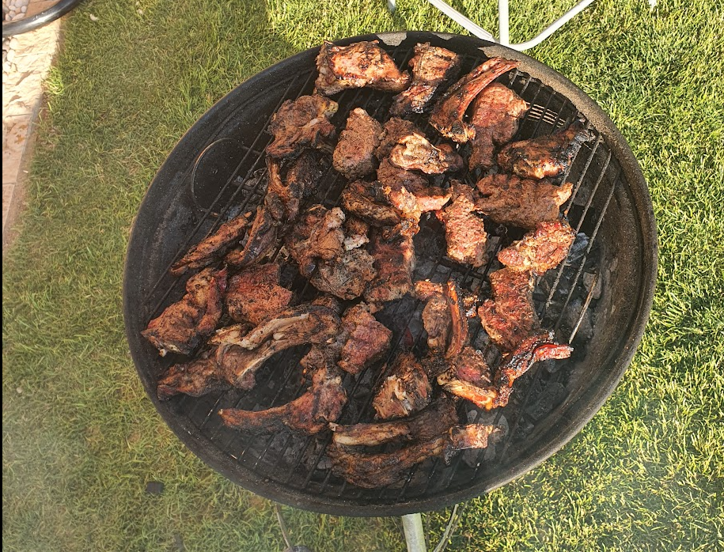
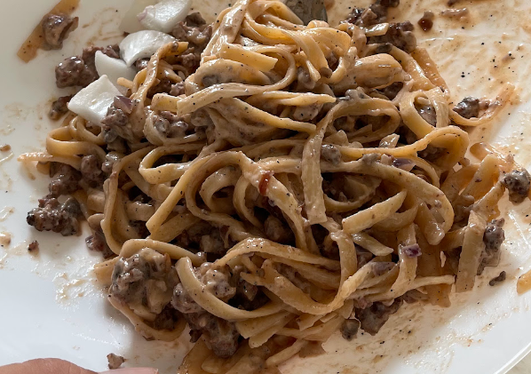

# UOL Eating Center 

Organizer's Note: please invite all your UOL friends, this is an open feast for all UOL students and staff of all sememsters.

 **please take most titles and texts as jokes, this is just a small feast organized by your serial foodie**

___

## Feast menu:

### Protien:
- **Signature Smoked Brisket™**
    
    *Delicious chunk of smokey beef, cooked for 16 hours in true texas Low-N-Slow style, for an unmatched Tenderness and taste. Risk of serious addiction*

    
    

    ---

- **Succulent Lamb  Ribs**

    *Some things need to be exerienced, and topping the list is those perfectly grilled lamb ribs. Perfected egyptian style marination combined with premium grade ribs make for one mouth watering spectacle.*

    `caution: risk of drool.`

    `caution: might ruin all kebab shops`
    

    ---

### Carbs:

- **Royal Sausage Pasta**

    *Not all carbs are created equal, and this sausage pasta knows it. Towering the carb heirarchy, this dish got style, got sass, and with each bite it bites back. worthy of italian royalty and deserving of love, every fork will have you shouting "mama mia!"*
    
